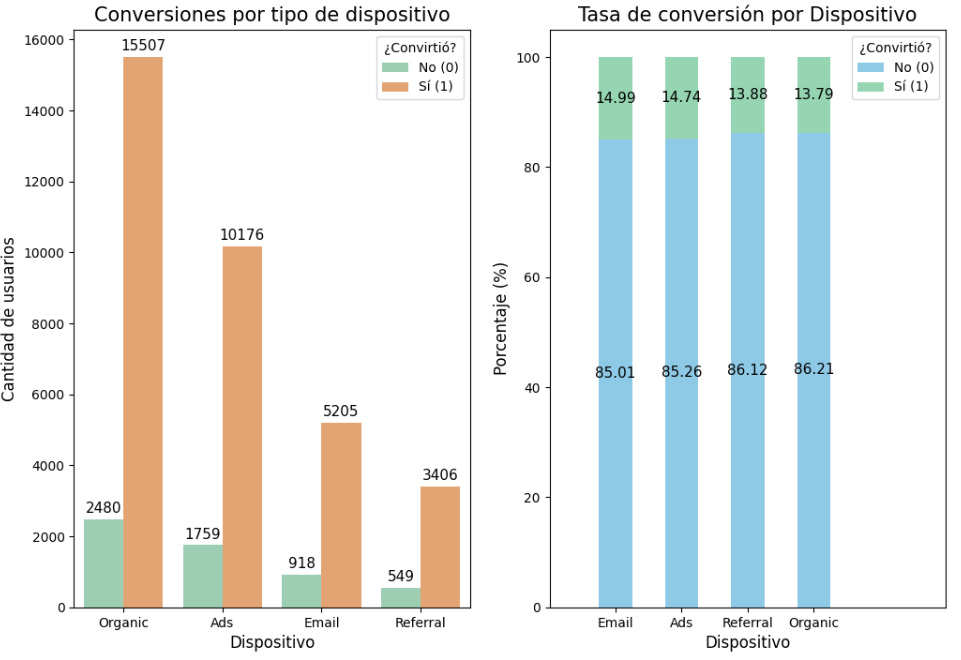
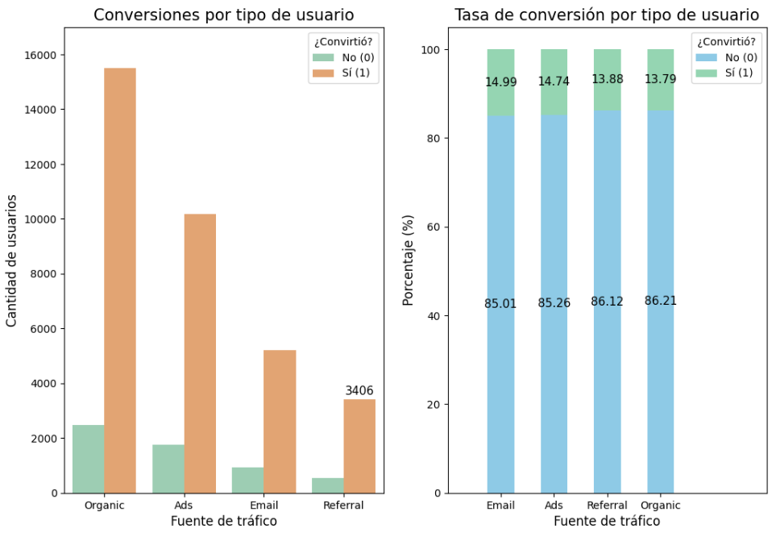
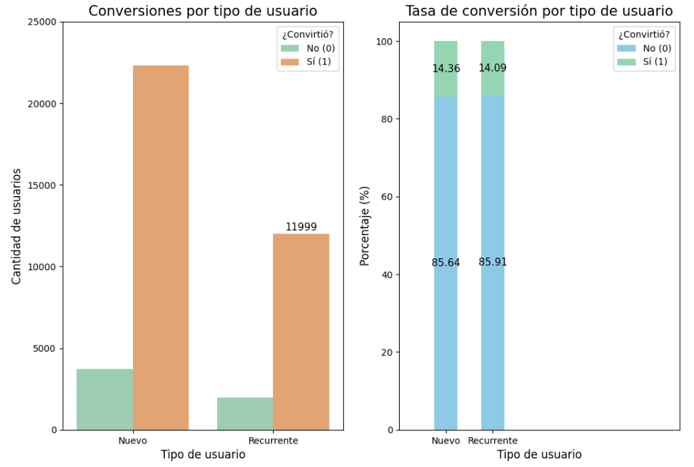

# A/B Testing Analysis: Landing Page Conversion Optimization
> Statistical evaluation of two landing page variants to guide a data-driven decision on conversion rate and revenue per user.

---

## Table of Contents
1. [Executive Summary](#executive-summary)
2. [Business Storytelling (SCQA)](#business-storytelling-scqa)
3. [Project Objectives](#project-objectives)
4. [Tech Stack](#tech-stack)
5. [Dataset](#dataset)
6. [Project Workflow](#project-workflow)
7. [Repository Structure](#repository-structure)
8. [Exploratory Data Visuals](#exploratory-data-visuals)
9. [Key Insights (C→F→I)](#key-insights-cfi)
10. [Business Recommendations](#business-recommendations)
11. [How to Reproduce](#how-to-reproduce)
12. [Future Improvements](#future-improvements)
13. [Lessons Learned](#lessons-learned)
14. [Author](#author)

---

## Executive Summary
This project evaluates an A/B experiment run on a company landing page to determine whether a new design (Variant B) outperforms the current one (Variant A) on two business-critical metrics: conversion rate and average spend per converting user. Making this call without statistical validation risks either discarding a genuinely better design or rolling out a change that does not actually move the business needle. The analysis applies hypothesis testing (Welch's t-test, z-test for proportions, chi-squared test of independence) to 40,000 user sessions collected over a 28-day window, and concludes with a clear, data-backed recommendation.

---

## Business Storytelling (SCQA)
- **S (Situation):** The company ran a controlled A/B test on its landing page, splitting incoming traffic (40,000 users, Jan 1–28, 2026) between Variant A and Variant B, tracking conversion and spend by region, device, traffic source, and user type.
- **C (Complication):** Before this analysis, the team had no statistically validated basis to choose between the two variants — a decision made on intuition could either forfeit revenue upside or justify a costly rollout with no real effect.
- **Q (Question):** Does Variant B produce a statistically significant improvement in conversion rate and average spend per user, and which acquisition channels should be prioritized around it?
- **A (Answer):** Variant B outperforms Variant A on both metrics with strong statistical significance: a 26.96% relative lift in conversion rate and a 12.54% lift in average spend per converting user. Traffic source is significantly associated with conversion, while user type (new vs. returning) is not.

---

## Project Objectives

### General Objective
Determine, with statistical rigor, which landing page variant should be adopted to maximize conversion rate and revenue per user.

### Specific Objectives
- Validate data quality and integrity (duplicates, types, completeness) before running any statistical test.
- Compare average spend per converting user between Variant A and Variant B.
- Compare conversion rate between Variant A and Variant B.
- Assess whether traffic source and user type influence conversion behavior.
- Translate statistical findings into actionable business recommendations.

---

## Tech Stack
| Technology | Role in the Project |
| :--- | :--- |
| **Python** | Data cleaning, exploratory data analysis (EDA), and statistical testing. |
| **Pandas** | Data loading, type correction (`datetime`), and aggregation. |
| **SciPy** | Welch's t-test, Levene's test, chi-squared test of independence. |
| **Statsmodels** | Two-proportion z-test for conversion rate comparison. |
| **Seaborn / Matplotlib** | Distribution and comparison charts supporting the business conclusions. |
| **Jupyter Notebook** | Interactive, documented analytical environment. |

---

## Dataset

| Attribute   | Description |
|-------------|-------------|
| Source      | Internal A/B test export, `landing_experiment.csv` |
| Records     | 40,000 users, 0 duplicate `user_id` values |
| Features    | `user_id`, `date`, `landing` (A/B), `region`, `dispositivo`, `traffic_source`, `user_type`, `converted`, `gasto` |
| Time Period | January 1, 2026 – January 28, 2026 (28 days) |
| Granularity | One row per user exposed to the experiment |

> **Note:** Two column names are kept in their original Spanish form (`dispositivo` = device, `gasto` = spend) to preserve fidelity with the source dataset, as defined in the project's naming standard.

---

## Project Workflow

```text
Data Extraction (.csv) → Data Validation & Cleaning (Pandas)
→ Statistical Hypothesis Testing (SciPy / Statsmodels) → Business Insights & Visualization (Seaborn/Matplotlib)
```

---

## Repository Structure

```text
proyecto-landing-experiment/
├── data/
│   ├── raw/
│   │   └── landing_experiment.csv
│   └── processed/
├── notebooks/
│   └── 01_eda_and_statistical_testing.ipynb
├── images/
│   ├── e1_conversion_by_device.png
│   ├── e2_conversion_by_user_type_and_traffic_source.png
│   └── e3_conversion_by_user_type.png
├── README.md
├── requirements.txt
└── .gitignore
```

---

## Exploratory Data Visuals

**Conversion by device type**


**Conversion by user type and traffic source**


**Conversion by user type**


---

## Key Insights (C→F→I)
> Each insight follows the **Cause → Finding → Impact/Action** chain, connecting the data with a specific business decision.

### Insight 1 — Variant B increases revenue per converting user
- **Cause:** Variant B's page design was tested against Variant A on average spend among users who converted.
- **Finding:** Welch's t-test rejected the null hypothesis (t = -9.48, p < 0.001). Average spend was $68.75 for Variant B versus $61.09 for Variant A — a 12.54% increase.
- **Impact / Recommended Action:** Prioritize Variant B in future rollouts; it generates a materially higher ticket size per converting user, not just more conversions.

### Insight 2 — Variant B drives a significantly higher conversion rate
- **Cause:** The two-proportion z-test compared conversion rate between Variant A and Variant B across the full 40,000-user sample.
- **Finding:** The test rejected the null hypothesis (z = -9.68, p < 0.001). Variant A converted at 12.57% versus 15.96% for Variant B — a 26.96% relative lift.
- **Impact / Recommended Action:** Move forward with a controlled or extended rollout of Variant B to confirm consistency of results before a full-scale implementation.

### Insight 3 — Traffic source is significantly associated with conversion, and Ads is the strategic channel
- **Cause:** A chi-squared test of independence evaluated the relationship between `traffic_source` and `converted` (see *Conversion by user type and traffic source* above).
- **Finding:** The test rejected the null hypothesis (χ² = 8.662, p = 0.034). Email (14.99%) and Ads (14.74%) converted at the highest rates, but Ads concentrates roughly 30% of total traffic while Email represents a much smaller share; Organic brings the highest volume but converts at a lower rate.
- **Impact / Recommended Action:** Treat Ads as the priority channel — it combines a competitive conversion rate with high volume, offering the largest addressable revenue opportunity. Evaluate scaling Email spend to capture more volume from an already efficient channel.

---

## Business Recommendations
- Roll out Variant B through a controlled or extended test phase to validate consistency and reduce implementation risk before a full launch.
- Since Variant B improved both conversion rate and average spend with strong statistical significance, prioritize it as the default landing page experience.
- Monitor conversion rate, average ticket, revenue per user, and channel-level performance continuously during the rollout phase.
- Treat Ads as a priority tracking segment given its combination of high traffic volume and competitive conversion.
- No statistically significant difference was found between new and returning users (z = 0.731, p = 0.464); maintain a consistent experience across both segments rather than building separate strategies for them.

---

## How to Reproduce
1. Clone the repository:
   ```bash
   git clone https://github.com/JacoboGO/Proyecto_Landing_Experiment.git
   cd Proyecto_Landing_Experiment
   ```
2. Create and activate a virtual environment:
   ```bash
   python -m venv venv
   source venv/bin/activate   # On Windows: venv\Scripts\activate
   ```
3. Install dependencies:
   ```bash
   pip install -r requirements.txt
   ```
4. Open the notebook:
   ```bash
   jupyter notebook notebooks/01_eda_and_statistical_testing.ipynb
   ```

---

## Future Improvements
- Automate the statistical testing pipeline to re-evaluate new weekly traffic cohorts dynamically.
- Incorporate predictive modeling (e.g., logistic regression or random forest) to estimate conversion probability and customer lifetime value (CLV) by region, device, and channel.
- Extend the device-level conversion analysis (see Exploratory Data Visuals) into a formal hypothesis test to confirm whether the observed pattern is statistically significant.

---

## Lessons Learned
- **Technical:** Choosing between Student's t-test and Welch's t-test should always be driven by a preliminary Levene's test for variance equality, not assumed.
- **Business:** A statistically significant lift does not automatically mean "roll out everywhere" — channel-level segmentation (Ads vs. Email vs. Organic) revealed where the real incremental opportunity lives.
- **Professional:** Structuring hypothesis tests as reusable functions (t-test, z-test) made the notebook auditable and easy to re-run against future cohorts — a habit worth carrying into every future project.

---

## Author

**Jacobo Galindo Ortiz**
Data Analyst Portfolio

[](https://www.linkedin.com/in/jacobo-galindo-ortiz)
[](https://github.com/JacoboGO)
[](https://public.tableau.com/app/profile/jacobo.galindo.ortiz/vizzes)
[](mailto:ing_j_g_ortiz@hotmail.com)

---

> *"Language is a window into the mind."*
> — Noam Chomsky

<div align="center">

If this project was useful to you, consider leaving a star
on the repository — it helps a lot and is greatly appreciated.

</div>

---

## Usage Notice

This repository is provided for portfolio and educational review purposes.

The project may be viewed to evaluate the analytical approach,
methodology, and implementation. It is not intended for redistribution,
commercial use, or incorporation into other projects without prior
written permission from the author.

If you would like to reference or discuss any part of this work,
please contact the author.
